# Component Interactions

This document details how different components within Mastra interact with each other, including communication patterns, data flow, and event handling.

## Inter-Component Communication Patterns

Mastra uses several communication patterns to enable loose coupling and flexible component interactions:

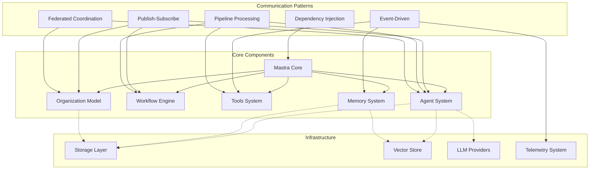

## Agent-Tool Interaction Flow

The interaction between agents and tools follows a structured pipeline:

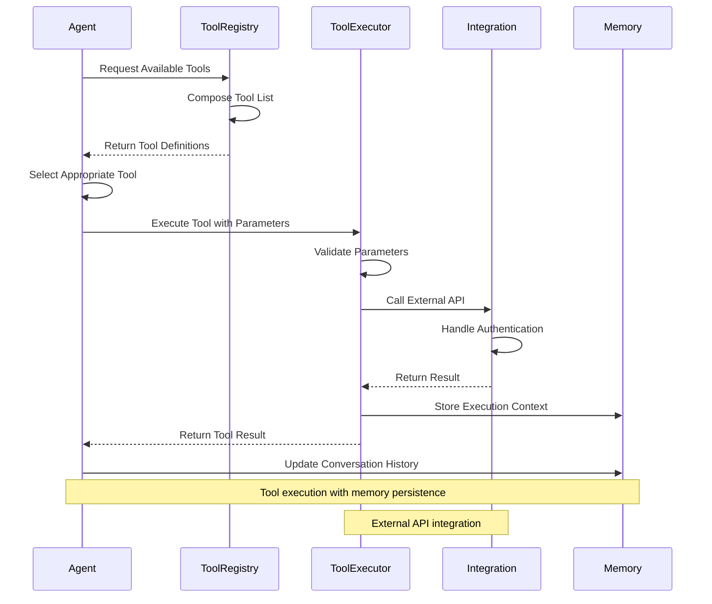

## Workflow-Agent Orchestration

Workflows can orchestrate multiple agents and coordinate their interactions:

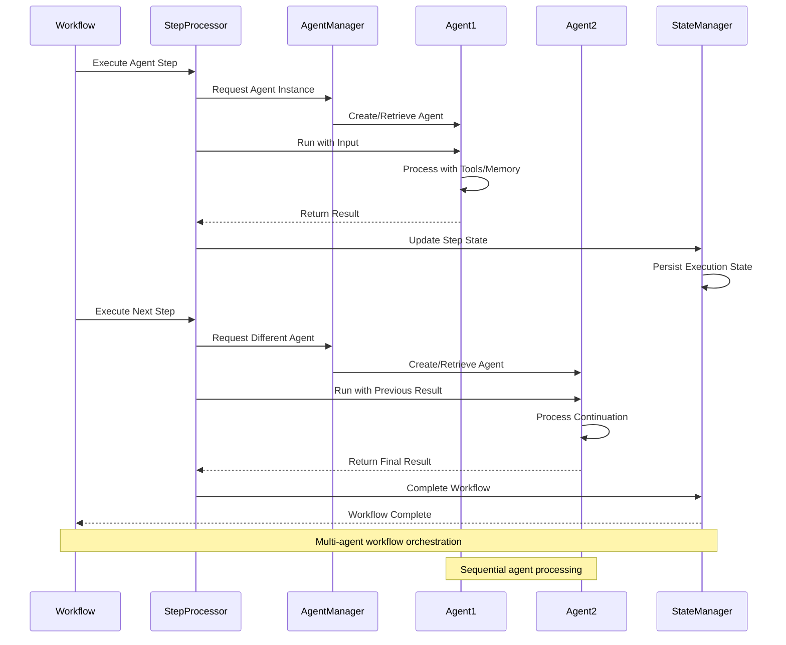

## Memory System Interactions

The memory system integrates with multiple components to provide persistent context:

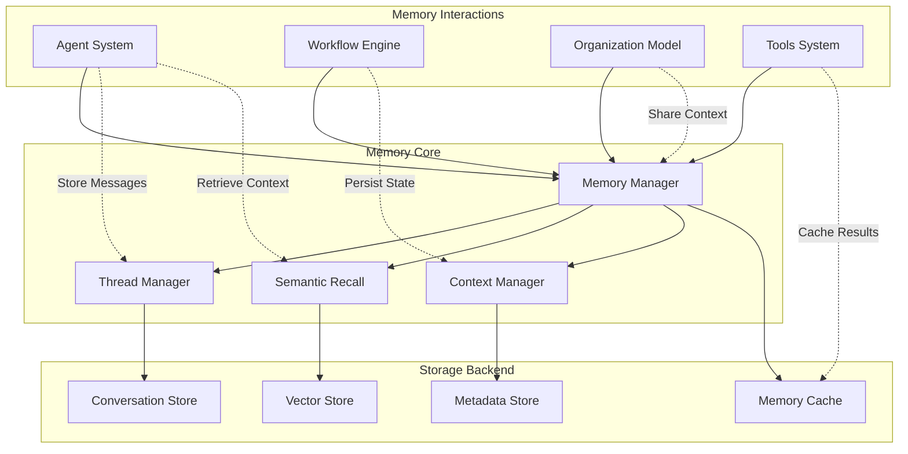

## Organization Model Integration

The organization model provides coordination capabilities across all components:

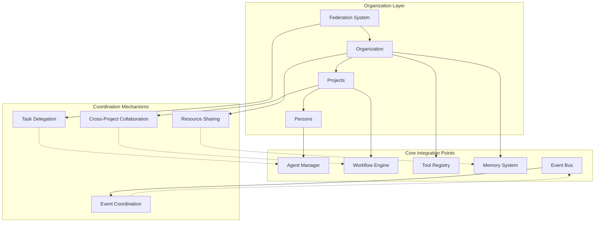

## Event-Driven Architecture

Mastra uses an event-driven architecture for loose coupling and real-time coordination:

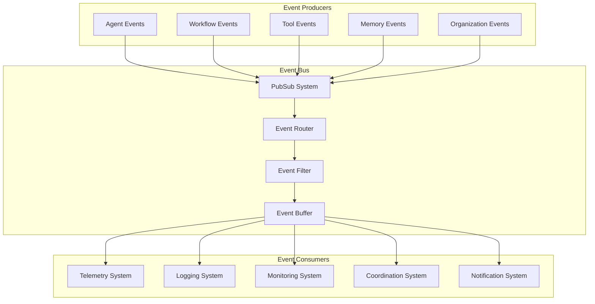

## Data Flow Architecture

Data flows through Mastra following clear patterns for processing and persistence:

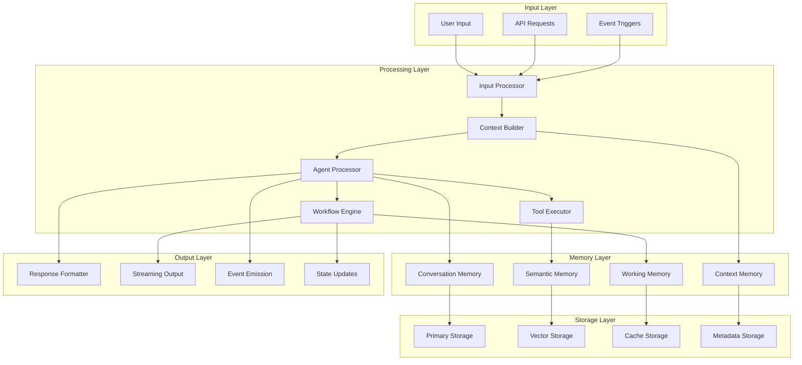

## Runtime Context Propagation

Context flows through the system to maintain state and configuration:

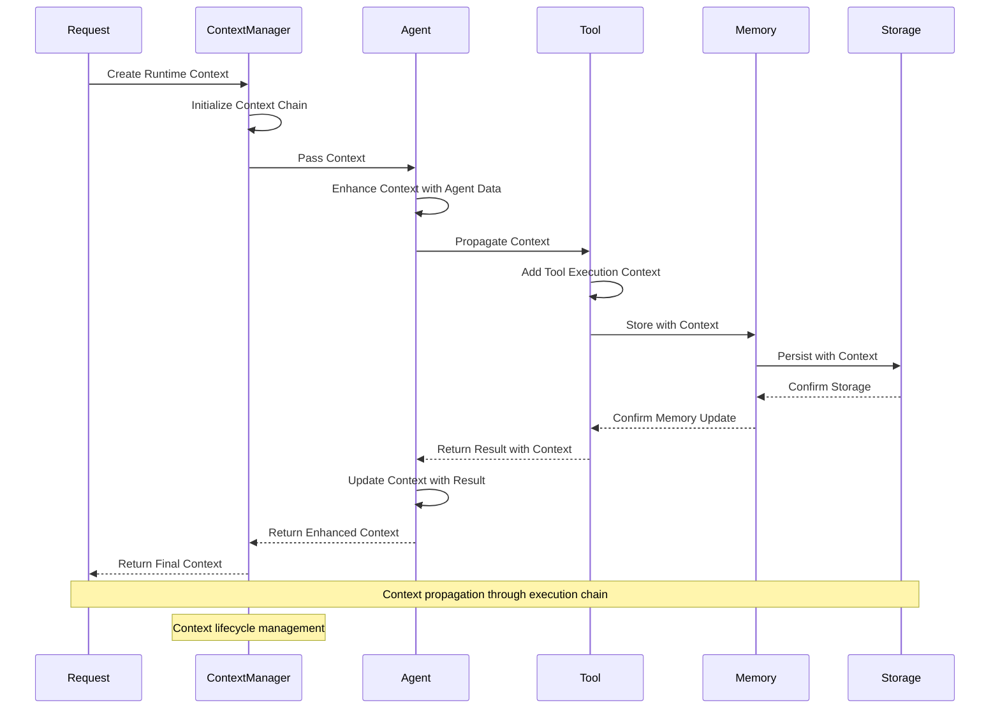

## Error Handling and Recovery

Mastra implements robust error handling across component boundaries:

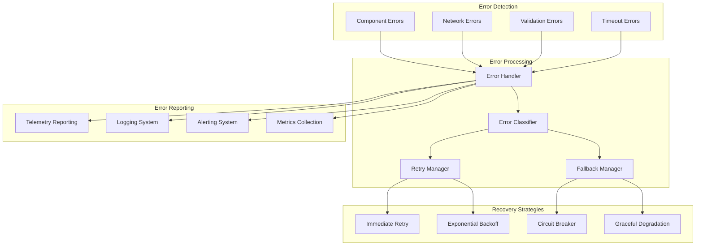

## Performance Optimization Patterns

Component interactions are optimized for performance through various patterns:

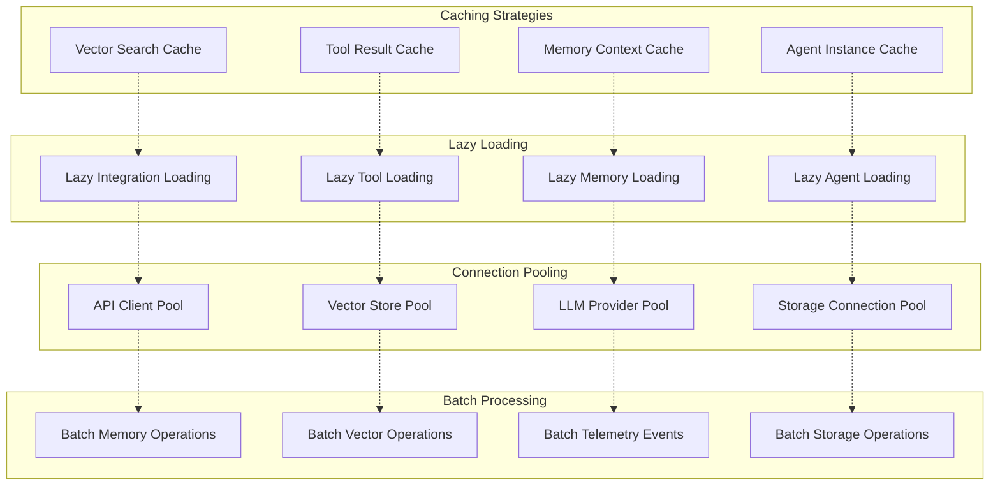

## Monitoring and Observability

Component interactions are monitored for performance and debugging:

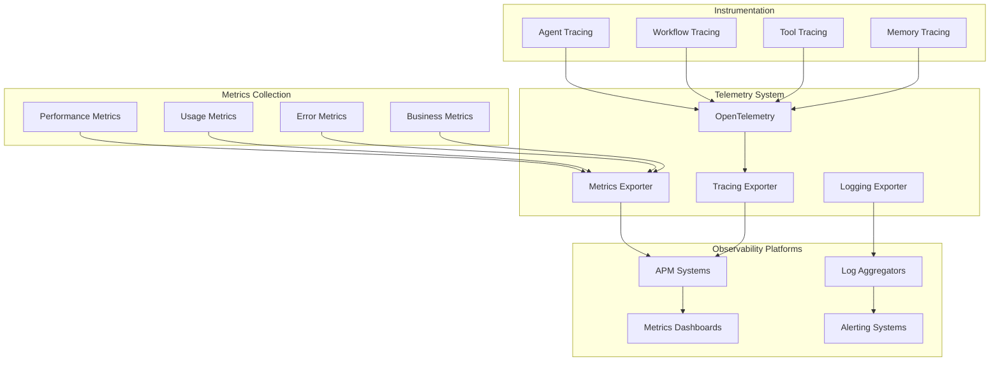

This comprehensive view of component interactions shows how Mastra maintains clean separation of concerns while enabling powerful coordination and collaboration between different parts of the system. The architecture supports both simple single-agent applications and complex multi-agent organizations with sophisticated coordination requirements.