# Data Flow Architecture

This document details how data flows through the Mastra system, including request processing, state management, memory persistence, and event propagation patterns.

## Overall Data Flow Architecture

Data flows through Mastra in a layered architecture with clear separation of concerns:

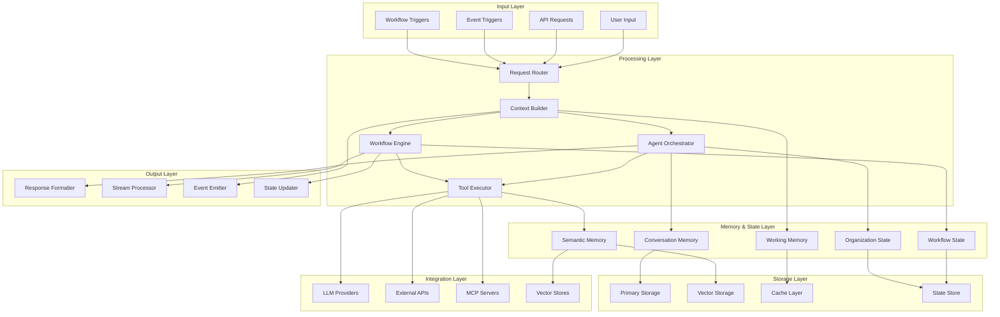

## Request Processing Flow

Every request follows a structured processing pipeline:

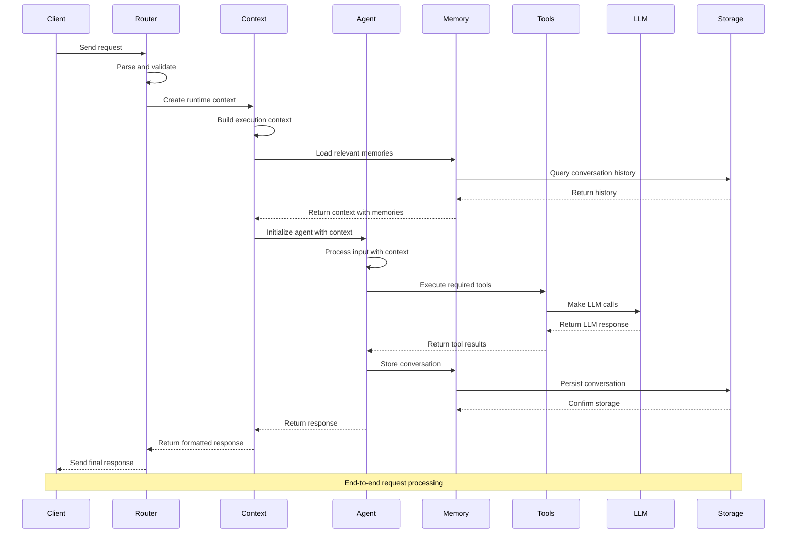

## Agent Data Flow

Agents process data through multiple stages with memory integration:

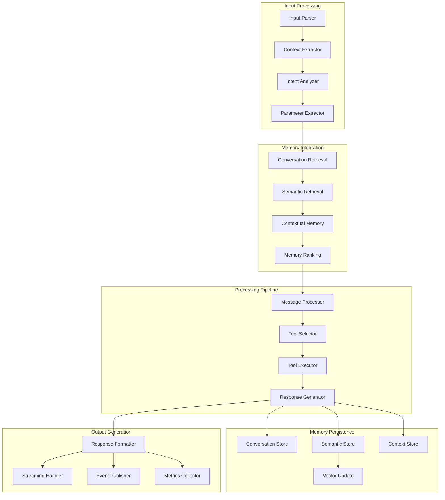

## Memory System Data Flow

The memory system manages multiple types of data with different persistence patterns:

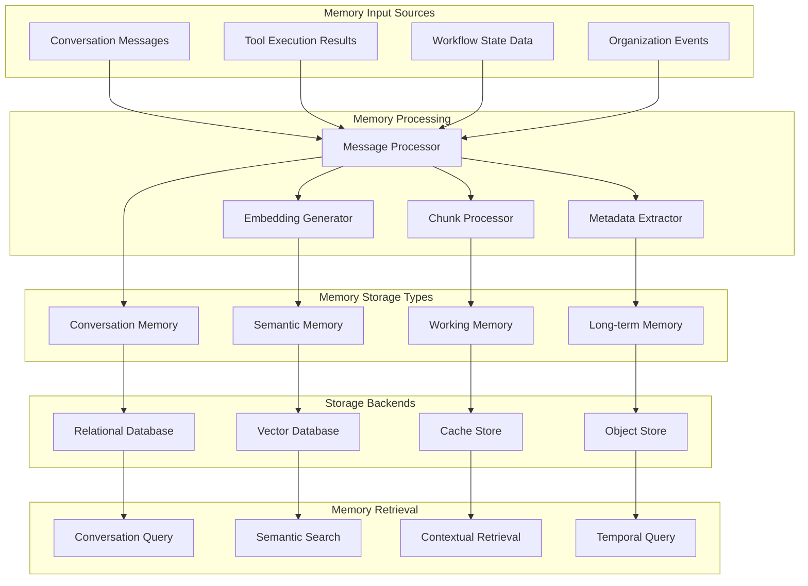

## Workflow Data Flow

Workflows manage state transitions and data flow between steps:

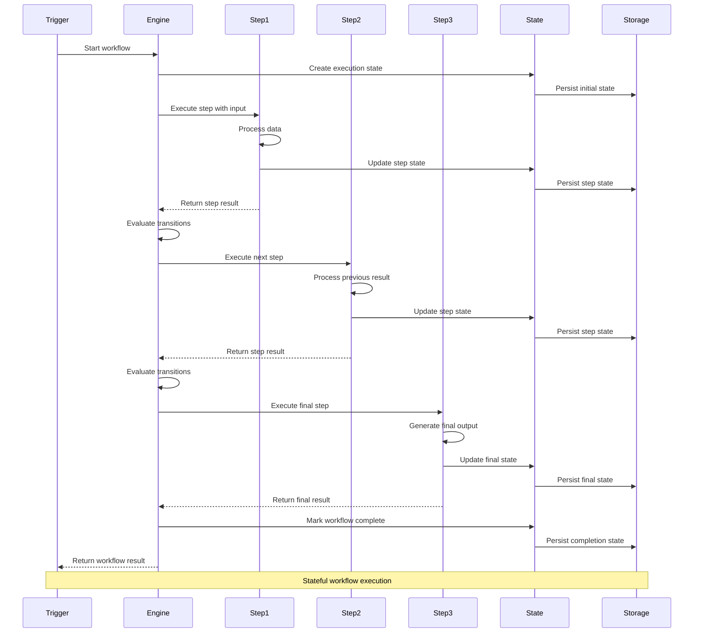

## Tool Execution Data Flow

Tools integrate with external systems and process data:

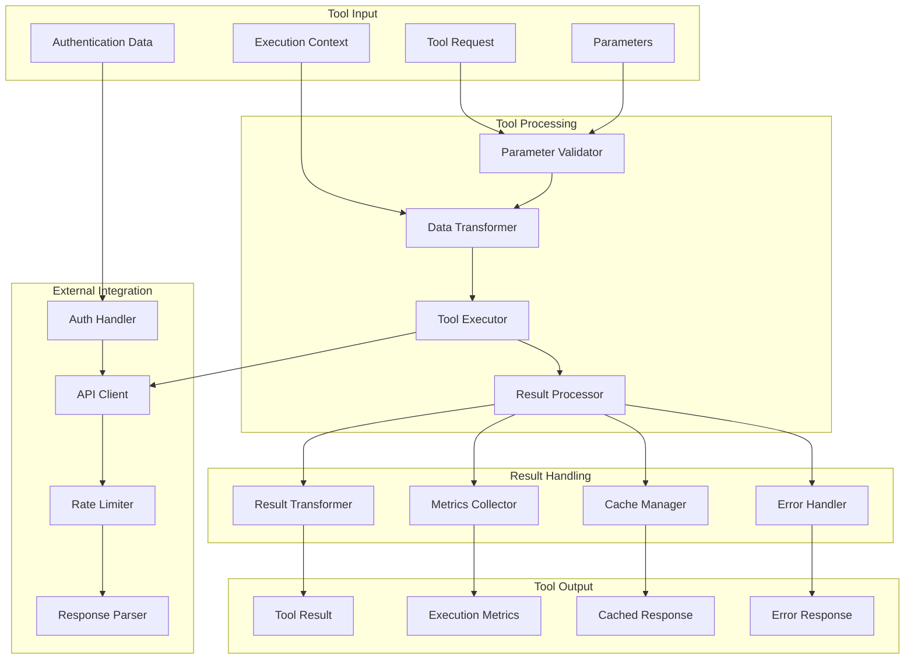

## Organization Model Data Flow

Organization entities coordinate data flow for federated operations:

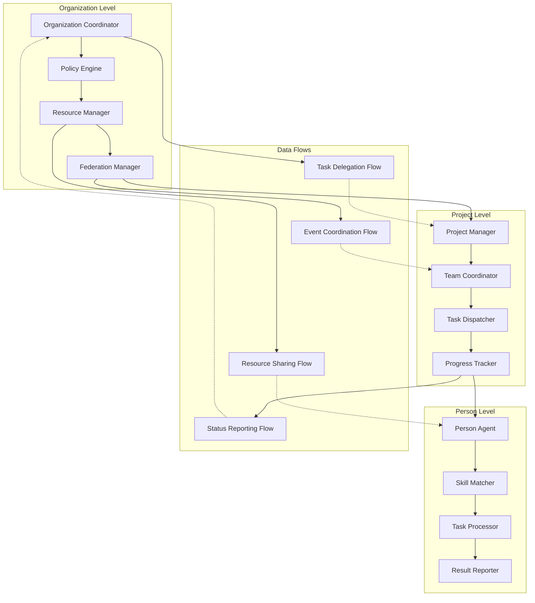

## Event-Driven Data Flow

Events propagate data changes throughout the system:

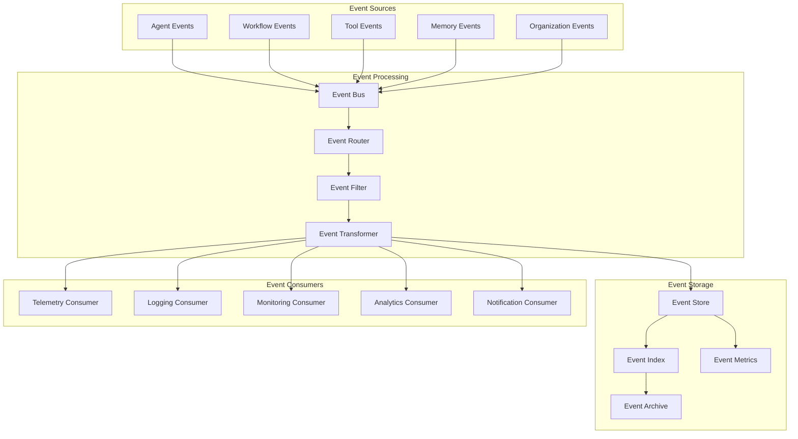

## Streaming Data Flow

Real-time data streaming for interactive applications:

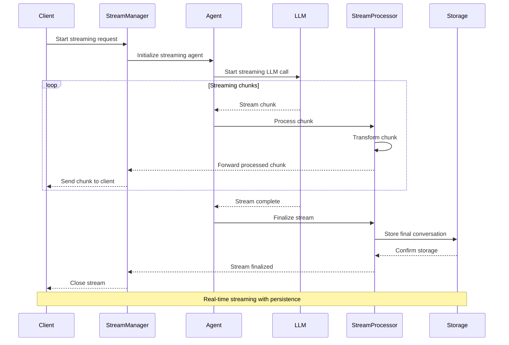

## Error and Recovery Data Flow

Error handling and recovery mechanisms maintain data integrity:

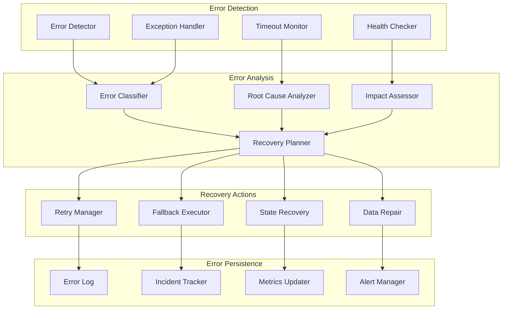

## Performance Optimization Data Flow

Data flow optimizations for high-performance operations:

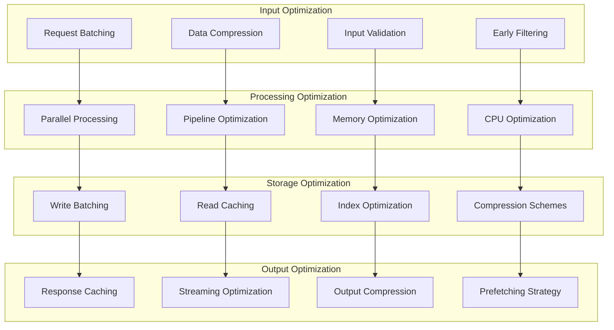

## Data Consistency and Integrity

Ensuring data consistency across distributed components:

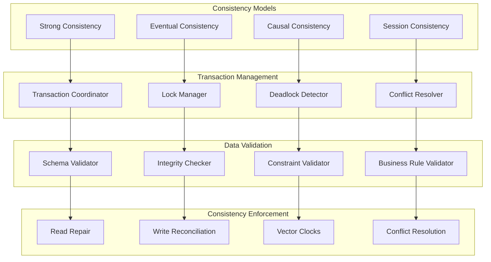

This comprehensive data flow architecture ensures that information moves efficiently and reliably through the Mastra system while maintaining consistency, performance, and fault tolerance. The architecture supports both simple single-agent workflows and complex multi-agent organizational coordination scenarios.