# Federation Patterns

Mastra's federation patterns enable sophisticated coordination and collaboration between distributed agents, organizations, and systems. This document details the architectural patterns that enable federated agency and intelligent task delegation.

## Federation Architecture Overview

The federation system provides hierarchical coordination with intelligent routing and delegation:

## Delegation Patterns

### Hierarchical Delegation

Tasks flow down the organizational hierarchy based on capability and availability:

### Lateral Delegation

Cross-functional collaboration between peers at the same organizational level:

### Capability-Based Delegation

Tasks are routed based on specific capabilities and expertise:

## Trust and Security Patterns

### Trust Network Architecture

Federation operates on configurable trust relationships:

```mermaid
graph TB
    subgraph "Trust Levels"
        FullTrust[Full Trust]
        LimitedTrust[Limited Trust]
        ConditionalTrust[Conditional Trust]
        NoTrust[No Trust]
    end
    
    subgraph "Trust Attributes"
        HistoricalPerformance[Historical Performance]
        SecurityClearance[Security Clearance]
        OrganizationalRole[Organizational Role]
        CertificationLevel[Certification Level]
    end
    
    subgraph "Trust Policies"
        DelegationPolicies[Delegation Policies]
        DataSharingPolicies[Data Sharing Policies]
        AccessControlPolicies[Access Control Policies]
        MonitoringPolicies[Monitoring Policies]
    end
    
    subgraph "Trust Enforcement"
        AuthenticationLayer[Authentication Layer]
        AuthorizationEngine[Authorization Engine]
        AuditLogger[Audit Logger]
        ComplianceChecker[Compliance Checker]
    end
    
    FullTrust --> HistoricalPerformance
    LimitedTrust --> SecurityClearance
    ConditionalTrust --> OrganizationalRole
    NoTrust --> CertificationLevel
    
    HistoricalPerformance --> DelegationPolicies
    SecurityClearance --> DataSharingPolicies
    OrganizationalRole --> AccessControlPolicies
    CertificationLevel --> MonitoringPolicies
    
    DelegationPolicies --> AuthenticationLayer
    DataSharingPolicies --> AuthorizationEngine
    AccessControlPolicies --> AuditLogger
    MonitoringPolicies --> ComplianceChecker
```

### Security Enforcement Flow

Security is enforced at every level of federation:

## Coordination Patterns

### Event-Driven Coordination

Federation uses events for real-time coordination:

### Consensus and Decision Making

Multi-agent decision making through consensus patterns:

## Load Balancing and Scaling Patterns

### Dynamic Load Distribution

Tasks are distributed based on current load and capacity:

### Auto-Scaling Patterns

Federated systems can automatically scale based on demand:

## Failure Handling and Recovery

### Circuit Breaker Pattern

Prevents cascade failures in federated systems:

### Retry and Fallback Strategies

Multiple strategies for handling failures:

## Performance Optimization Patterns

### Caching Strategies

Multi-level caching for federation performance:

### Batch Processing Patterns

Efficient handling of multiple operations:

## Monitoring and Observability

### Federation Metrics

Comprehensive monitoring of federation health:

These federation patterns enable Mastra to scale from simple agent interactions to complex multi-organizational coordination while maintaining performance, security, and reliability. The patterns provide a foundation for building sophisticated AI systems that can coordinate across organizational boundaries while maintaining proper governance and security controls.