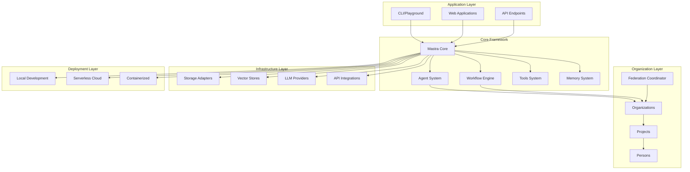

# Technical Architecture Overview

Mastra is a modular TypeScript framework for building AI agents and assistants, designed around central orchestration with pluggable components. This section provides comprehensive technical documentation of the architecture, with detailed focus on the organization model and component interactions.

## Architecture Principles

Mastra is built on several key architectural principles:

1. **Modular Design**: Components are loosely coupled and can be independently developed and deployed
2. **Dependency Injection**: Central configuration hub with pluggable component registration
3. **Plugin Architecture**: Extensible through standardized interfaces for storage, vectors, memory, and deployment
4. **Event-Driven Coordination**: Real-time coordination through publish-subscribe mechanisms
5. **Runtime Context**: Request-scoped context propagation for dynamic configuration
6. **Federated Agency**: Hierarchical organization structure enabling intelligent task delegation

## High-Level Architecture



## Package Architecture

Mastra follows a monorepo structure with clearly defined package boundaries:

```mermaid
graph LR
    subgraph "Core Packages"
        Core[@mastra/core]
        CLI[@mastra/cli]
        Server[@mastra/server]
        Memory[@mastra/memory]
        RAG[@mastra/rag]
        Evals[@mastra/evals]
        MCP[@mastra/mcp]
    end
    
    subgraph "Storage Adapters"
        PG[stores/pg]
        Chroma[stores/chroma]
        Pinecone[stores/pinecone]
        Redis[stores/redis]
    end
    
    subgraph "Deployment Adapters"
        Vercel[deployers/vercel]
        Netlify[deployers/netlify]
        CF[deployers/cloudflare]
    end
    
    subgraph "Integrations"
        GitHub[integrations/github]
        Firecrawl[integrations/firecrawl]
        More[integrations/...]
    end
    
    subgraph "Client SDKs"
        JS[client-sdks/js]
        React[client-sdks/react]
        Mobile[client-sdks/mobile]
    end
    
    Core --> Memory
    Core --> RAG
    Core --> Evals
    Core --> MCP
    CLI --> Core
    Server --> Core
    
    Core -.-> PG
    Core -.-> Chroma
    Core -.-> Pinecone
    Core -.-> Redis
    
    CLI -.-> Vercel
    CLI -.-> Netlify
    CLI -.-> CF
    
    Core -.-> GitHub
    Core -.-> Firecrawl
    Core -.-> More
    
    JS --> Core
    React --> Core
    Mobile --> Core
```

## Component Interaction Patterns

The framework uses several key interaction patterns:

1. **Dependency Injection Pattern**: Components register with the central Mastra instance
2. **Observer Pattern**: Event-driven coordination through pubsub
3. **Strategy Pattern**: Pluggable implementations for storage, vectors, and deployment
4. **Chain of Responsibility**: Tool and workflow execution pipelines
5. **Federated Coordination**: Hierarchical delegation and collaboration patterns

## Key Interfaces

### Storage Interface
All storage adapters implement a standardized interface for data persistence:

```typescript
interface MastraStorage {
  get(key: string): Promise<any>;
  set(key: string, value: any): Promise<void>;
  delete(key: string): Promise<void>;
  list(prefix?: string): Promise<string[]>;
}
```

### Vector Interface
Vector stores provide semantic search capabilities:

```typescript
interface MastraVector {
  embed(text: string): Promise<number[]>;
  search(query: string, limit?: number): Promise<SearchResult[]>;
  store(id: string, vector: number[], metadata?: any): Promise<void>;
}
```

### Agent Interface
Agents provide the primary AI interaction abstraction:

```typescript
interface Agent {
  run(input: string, context?: RunContext): Promise<AgentResult>;
  stream(input: string, context?: RunContext): AsyncIterator<AgentChunk>;
  addTool(tool: Tool): void;
  setMemory(memory: MastraMemory): void;
}
```

## Next Steps

Explore the detailed architecture documentation:

- [System Architecture](./system-architecture) - Detailed component breakdown
- [Organization Model](./organization-model) - Hierarchical coordination system
- [Component Interactions](./component-interactions) - Communication patterns
- [Plugin Architecture](./plugin-architecture) - Extensibility mechanisms
- [Federation Patterns](./federation-patterns) - Task delegation and coordination
- [Data Flow](./data-flow) - Information flow through the system