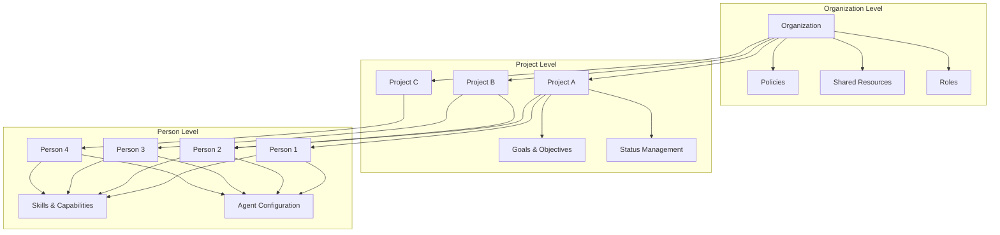
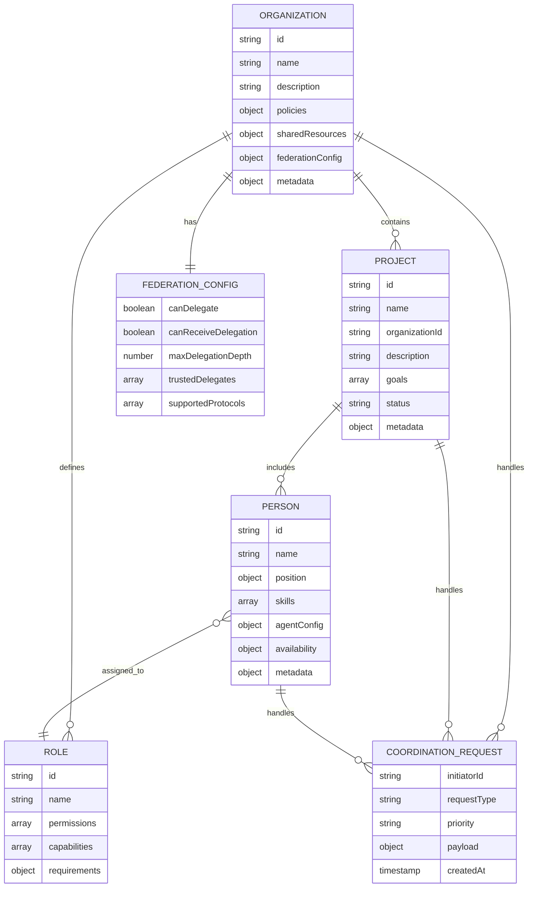
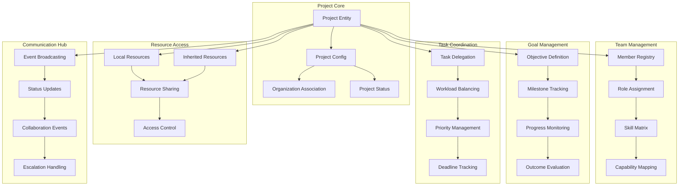
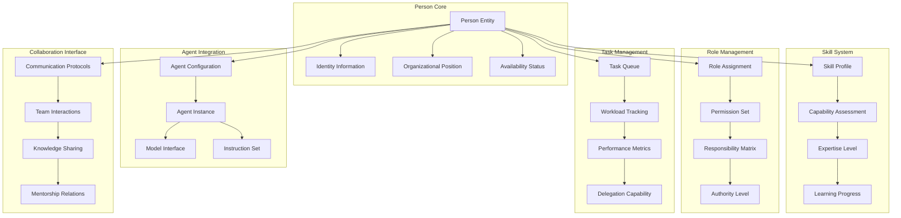
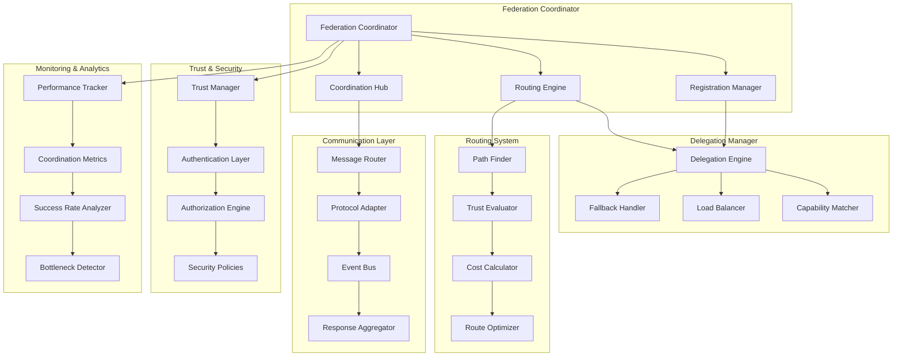
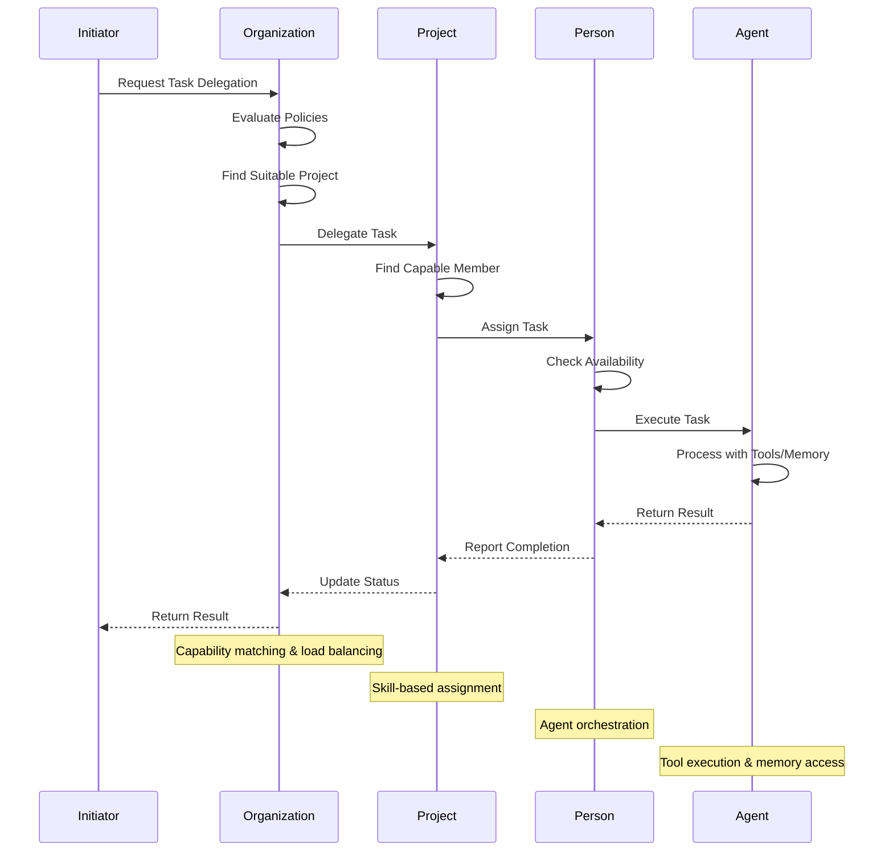
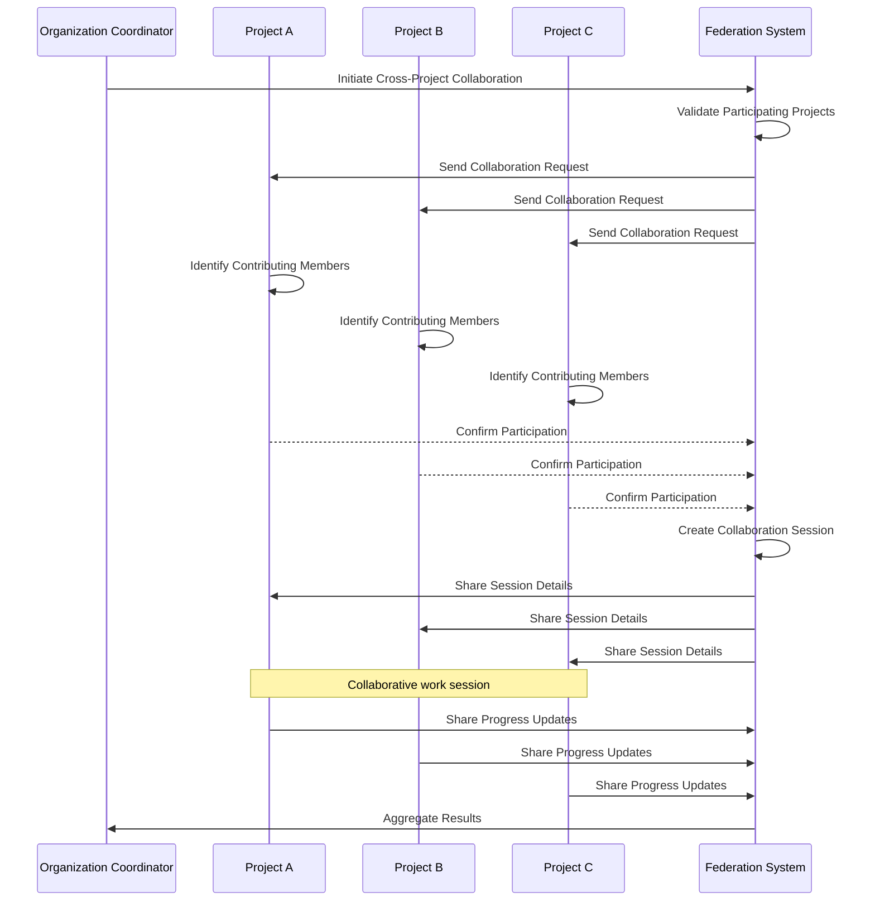
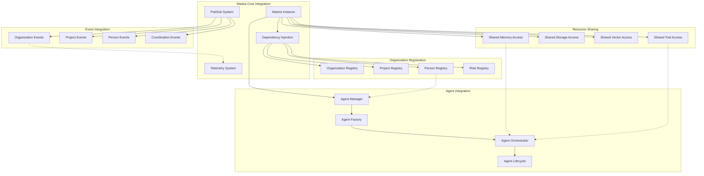

# Organization Model Architecture

The organization model is a key architectural component of Mastra that provides hierarchical structure for coordinating AI agents and workflows. It enables federated agency through intelligent task delegation and cross-team collaboration.

## Organizational Hierarchy

The organization model follows a three-tier hierarchical structure:



## Entity Relationships and Data Model

The organization model defines clear relationships between entities:



## Organization Entity Architecture

The Organization entity serves as the top-level container:

```mermaid
graph TB
    subgraph "Organization Core"
        OrgEntity[Organization Entity]
        Config[Organization Config]
        ID[Unique Identifier]
        Name[Organization Name]
    end
    
    subgraph "Resource Management"
        SharedTools[Shared Tools]
        SharedWorkflows[Shared Workflows]
        SharedMemory[Shared Memory]
        SharedStorage[Shared Storage]
        SharedVectors[Shared Vectors]
    end
    
    subgraph "Policy Framework"
        CollabPolicy[Collaboration Policy]
        DelegationPolicy[Delegation Policy]
        SecurityPolicy[Security Policy]
        AccessControl[Access Control]
    end
    
    subgraph "Role System"
        RoleRegistry[Role Registry]
        PermissionManager[Permission Manager]
        CapabilityMatcher[Capability Matcher]
        RoleValidator[Role Validator]
    end
    
    subgraph "Project Management"
        ProjectRegistry[Project Registry]
        ProjectLifecycle[Project Lifecycle]
        ProjectCoordination[Project Coordination]
        CrossProjectCollab[Cross-Project Collaboration]
    end
    
    subgraph "Federation Layer"
        FedConfig[Federation Configuration]
        TrustNetwork[Trust Network]
        DelegationChain[Delegation Chain]
        ProtocolSupport[Protocol Support]
    end
    
    OrgEntity --> Config
    Config --> ID
    Config --> Name
    
    OrgEntity --> SharedTools
    OrgEntity --> SharedWorkflows
    OrgEntity --> SharedMemory
    OrgEntity --> SharedStorage
    OrgEntity --> SharedVectors
    
    OrgEntity --> CollabPolicy
    OrgEntity --> DelegationPolicy
    OrgEntity --> SecurityPolicy
    OrgEntity --> AccessControl
    
    OrgEntity --> RoleRegistry
    RoleRegistry --> PermissionManager
    PermissionManager --> CapabilityMatcher
    CapabilityMatcher --> RoleValidator
    
    OrgEntity --> ProjectRegistry
    ProjectRegistry --> ProjectLifecycle
    ProjectLifecycle --> ProjectCoordination
    ProjectCoordination --> CrossProjectCollab
    
    OrgEntity --> FedConfig
    FedConfig --> TrustNetwork
    TrustNetwork --> DelegationChain
    DelegationChain --> ProtocolSupport
```



## Project Entity Architecture

Projects coordinate teams working toward specific goals:



## Person Entity Architecture

Persons wrap AI agents with organizational context:



## Federation & Coordination System

The federation system enables intelligent task delegation and coordination:



## Task Delegation Flow

The delegation process follows a structured workflow:



## Cross-Project Collaboration Flow

Coordination between multiple projects:



## Integration with Mastra Core

The organization model integrates seamlessly with Mastra's core components:



## Configuration and Setup

Example organization model configuration:

```typescript
// Organization configuration
const organization = new Organization({
  id: 'tech-company',
  name: 'Tech Company Inc.',
  description: 'An innovative technology company',
  
  // Define organizational roles
  roles: {
    'ceo': {
      id: 'ceo',
      name: 'Chief Executive Officer',
      permissions: ['strategic-decisions', 'resource-allocation'],
      capabilities: ['leadership', 'strategy', 'vision'],
    },
    'engineer': {
      id: 'engineer',
      name: 'Software Engineer',
      permissions: ['code-development', 'code-review'],
      capabilities: ['programming', 'testing', 'debugging'],
    },
  },
  
  // Organization policies
  policies: {
    delegation: { 
      maxDepth: 5,
      requiresApproval: false 
    },
    collaboration: { 
      crossProjectAllowed: true,
      externalCollaboration: false 
    },
  },
  
  // Shared resources
  sharedResources: {
    memory: sharedMemoryInstance,
    storage: sharedStorageInstance,
    vectors: { 'main': vectorStoreInstance },
  },
  
  // Federation configuration
  federationConfig: {
    canDelegate: true,
    canReceiveDelegation: true,
    maxDelegationDepth: 10,
    trustedDelegates: ['partner-org-1'],
    supportedProtocols: ['direct', 'broadcast', 'hierarchical'],
  },
});
```

This architecture enables sophisticated organizational coordination while maintaining the simplicity and power of the Mastra framework. It provides a robust foundation for scaling from individual agents to complex multi-agent organizations with federated decision-making capabilities.