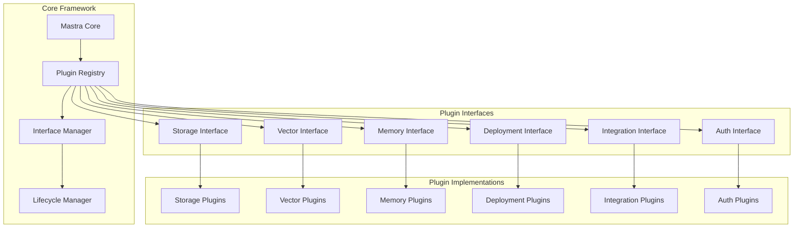
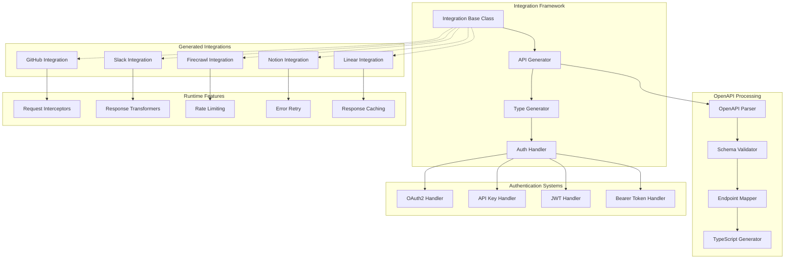
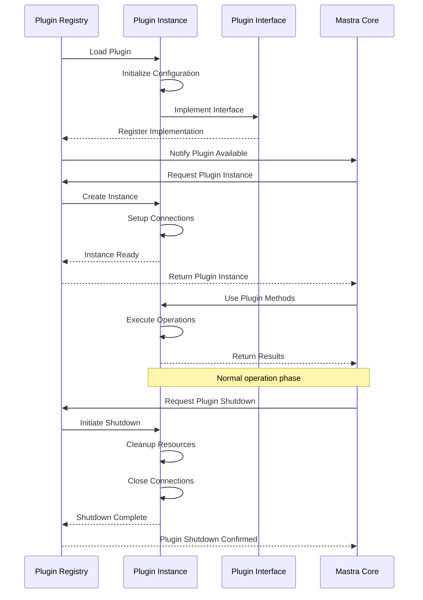
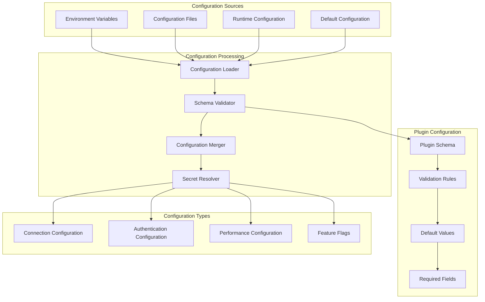
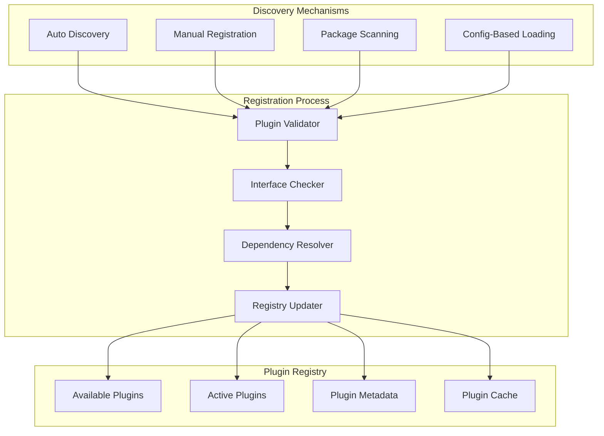
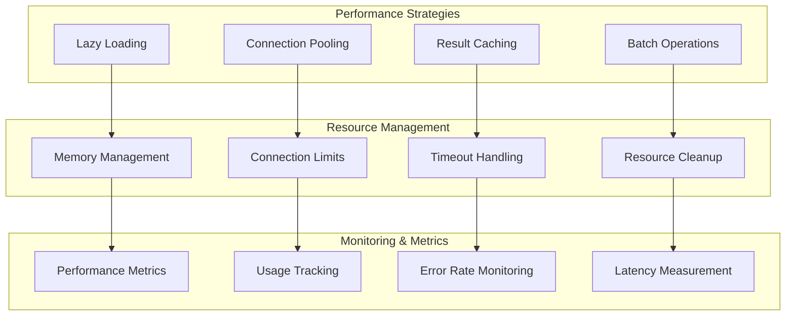
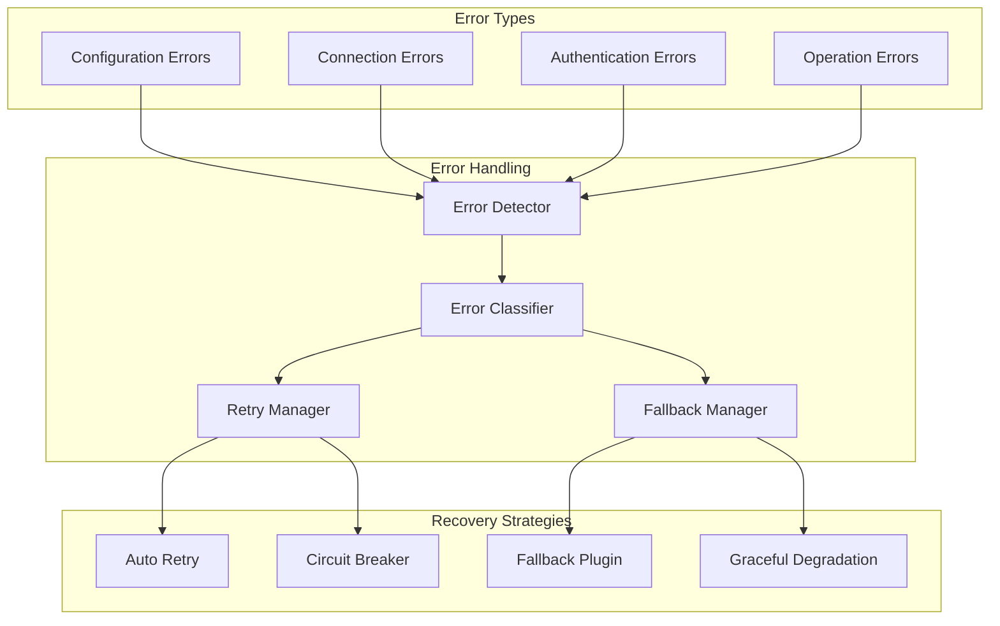

# Plugin Architecture

Mastra's plugin architecture enables extensibility through standardized interfaces for storage, vectors, memory, deployment, and integrations. This document details the plugin system design and implementation patterns.

## Plugin System Overview

The plugin architecture follows a modular design where components can be plugged in and out without affecting the core framework:



## Storage Plugin Architecture

Storage plugins provide data persistence capabilities through a standardized interface:

```mermaid
graph TB
    subgraph "Storage Interface Definition"
        IStorage[IStorage Interface]
        GetMethod[get(key: string)]
        SetMethod[set(key: string, value: any)]
        DeleteMethod[delete(key: string)]
        ListMethod[list(prefix?: string)]
        TransactionMethod[transaction(operations)]
    end
    
    subgraph "Storage Plugin Implementations"
        PostgreSQLPlugin[PostgreSQL Plugin]
        RedisPlugin[Redis Plugin]
        FileSystemPlugin[File System Plugin]
        InMemoryPlugin[In-Memory Plugin]
        S3Plugin[S3 Plugin]
        MongoDBPlugin[MongoDB Plugin]
    end
    
    subgraph "Plugin Features"
        ConnectionManagement[Connection Management]
        TransactionSupport[Transaction Support]
        CachingLayer[Caching Layer]
        HealthChecking[Health Checking]
        MetricsCollection[Metrics Collection]
    end
    
    IStorage --> GetMethod
    IStorage --> SetMethod
    IStorage --> DeleteMethod
    IStorage --> ListMethod
    IStorage --> TransactionMethod
    
    IStorage -.-> PostgreSQLPlugin
    IStorage -.-> RedisPlugin
    IStorage -.-> FileSystemPlugin
    IStorage -.-> InMemoryPlugin
    IStorage -.-> S3Plugin
    IStorage -.-> MongoDBPlugin
    
    PostgreSQLPlugin --> ConnectionManagement
    RedisPlugin --> ConnectionManagement
    FileSystemPlugin --> CachingLayer
    InMemoryPlugin --> HealthChecking
    S3Plugin --> MetricsCollection
    MongoDBPlugin --> TransactionSupport
```

## Vector Store Plugin Architecture

Vector plugins enable semantic search and embedding storage:

```mermaid
graph TB
    subgraph "Vector Interface Definition"
        IVector[IVector Interface]
        EmbedMethod[embed(text: string)]
        SearchMethod[search(query, limit?)]
        StoreMethod[store(id, vector, metadata?)]
        UpdateMethod[update(id, vector, metadata?)]
        DeleteVectorMethod[delete(id: string)]
        BulkOperations[bulkStore/bulkDelete]
    end
    
    subgraph "Vector Plugin Implementations"
        ChromaPlugin[Chroma DB Plugin]
        PineconePlugin[Pinecone Plugin]
        WeaviatePlugin[Weaviate Plugin]
        LocalVectorPlugin[Local Vector Plugin]
        QdrantPlugin[Qdrant Plugin]
        MilvusPlugin[Milvus Plugin]
    end
    
    subgraph "Embedding Providers"
        OpenAIEmbeddings[OpenAI Embeddings]
        HuggingFaceEmbeddings[HuggingFace Embeddings]
        LocalEmbeddings[Local Embeddings]
        CustomEmbeddings[Custom Embeddings]
    end
    
    subgraph "Vector Operations"
        SimilaritySearch[Similarity Search]
        HybridSearch[Hybrid Search]
        FilteredSearch[Filtered Search]
        ClusteringOps[Clustering Operations]
    end
    
    IVector --> EmbedMethod
    IVector --> SearchMethod
    IVector --> StoreMethod
    IVector --> UpdateMethod
    IVector --> DeleteVectorMethod
    IVector --> BulkOperations
    
    IVector -.-> ChromaPlugin
    IVector -.-> PineconePlugin
    IVector -.-> WeaviatePlugin
    IVector -.-> LocalVectorPlugin
    IVector -.-> QdrantPlugin
    IVector -.-> MilvusPlugin
    
    ChromaPlugin --> OpenAIEmbeddings
    PineconePlugin --> HuggingFaceEmbeddings
    WeaviatePlugin --> LocalEmbeddings
    LocalVectorPlugin --> CustomEmbeddings
    
    ChromaPlugin --> SimilaritySearch
    PineconePlugin --> HybridSearch
    WeaviatePlugin --> FilteredSearch
    LocalVectorPlugin --> ClusteringOps
```

## Integration Plugin Architecture

Integration plugins provide type-safe API clients for third-party services:



## Deployment Plugin Architecture

Deployment plugins enable platform-specific deployment strategies:

```mermaid
graph TB
    subgraph "Deployment Interface"
        IDeployment[IDeployment Interface]
        BuildMethod[build(config)]
        DeployMethod[deploy(artifact)]
        StatusMethod[getStatus()]
        LogsMethod[getLogs()]
        RollbackMethod[rollback(version)]
    end
    
    subgraph "Platform Plugins"
        VercelDeployer[Vercel Deployer]
        NetlifyDeployer[Netlify Deployer]
        CloudflareDeployer[Cloudflare Deployer]
        AWSLambdaDeployer[AWS Lambda Deployer]
        AzureFunctionsDeployer[Azure Functions Deployer]
        DockerDeployer[Docker Deployer]
    end
    
    subgraph "Build Pipeline"
        AssetBundler[Asset Bundler]
        DependencyResolver[Dependency Resolver]
        CodeOptimizer[Code Optimizer]
        EnvironmentBuilder[Environment Builder]
    end
    
    subgraph "Deployment Features"
        BlueeGreenDeployment[Blue-Green Deployment]
        CanaryDeployment[Canary Deployment]
        RollingUpdate[Rolling Update]
        AutoScaling[Auto Scaling]
        HealthChecks[Health Checks]
    end
    
    IDeployment --> BuildMethod
    IDeployment --> DeployMethod
    IDeployment --> StatusMethod
    IDeployment --> LogsMethod
    IDeployment --> RollbackMethod
    
    IDeployment -.-> VercelDeployer
    IDeployment -.-> NetlifyDeployer
    IDeployment -.-> CloudflareDeployer
    IDeployment -.-> AWSLambdaDeployer
    IDeployment -.-> AzureFunctionsDeployer
    IDeployment -.-> DockerDeployer
    
    VercelDeployer --> AssetBundler
    NetlifyDeployer --> DependencyResolver
    CloudflareDeployer --> CodeOptimizer
    AWSLambdaDeployer --> EnvironmentBuilder
    
    VercelDeployer --> BlueeGreenDeployment
    NetlifyDeployer --> CanaryDeployment
    CloudflareDeployer --> RollingUpdate
    AWSLambdaDeployer --> AutoScaling
    AzureFunctionsDeployer --> HealthChecks
```

## Authentication Plugin Architecture

Authentication plugins provide secure access to external services:

```mermaid
graph TB
    subgraph "Auth Interface"
        IAuth[IAuth Interface]
        AuthenticateMethod[authenticate()]
        RefreshMethod[refreshToken()]
        ValidateMethod[validateToken()]
        RevokeMethod[revokeToken()]
        GetUserMethod[getUserInfo()]
    end
    
    subgraph "Auth Providers"
        OAuth2Provider[OAuth2 Provider]
        OIDCProvider[OIDC Provider]
        SAMLProvider[SAML Provider]
        APIKeyProvider[API Key Provider]
        JWTProvider[JWT Provider]
        BasicAuthProvider[Basic Auth Provider]
    end
    
    subgraph "Token Management"
        TokenStore[Token Store]
        TokenValidator[Token Validator]
        TokenRefresher[Token Refresher]
        TokenCache[Token Cache]
    end
    
    subgraph "Security Features"
        EncryptionHandler[Encryption Handler]
        SecureStorage[Secure Storage]
        AuditLogger[Audit Logger]
        RateLimiter[Rate Limiter]
    end
    
    IAuth --> AuthenticateMethod
    IAuth --> RefreshMethod
    IAuth --> ValidateMethod
    IAuth --> RevokeMethod
    IAuth --> GetUserMethod
    
    IAuth -.-> OAuth2Provider
    IAuth -.-> OIDCProvider
    IAuth -.-> SAMLProvider
    IAuth -.-> APIKeyProvider
    IAuth -.-> JWTProvider
    IAuth -.-> BasicAuthProvider
    
    OAuth2Provider --> TokenStore
    OIDCProvider --> TokenValidator
    SAMLProvider --> TokenRefresher
    APIKeyProvider --> TokenCache
    
    TokenStore --> EncryptionHandler
    TokenValidator --> SecureStorage
    TokenRefresher --> AuditLogger
    TokenCache --> RateLimiter
```

## Plugin Lifecycle Management

Plugins follow a standardized lifecycle with proper initialization and cleanup:



## Plugin Configuration System

Plugins use a standardized configuration system for consistency:



## Plugin Development Patterns

### Base Plugin Class

```typescript
abstract class BasePlugin {
  protected config: PluginConfig;
  protected logger: Logger;
  protected telemetry: Telemetry;
  
  constructor(config: PluginConfig) {
    this.config = this.validateConfig(config);
    this.logger = config.logger;
    this.telemetry = config.telemetry;
  }
  
  abstract async initialize(): Promise<void>;
  abstract async shutdown(): Promise<void>;
  abstract getHealth(): HealthStatus;
  
  protected validateConfig(config: PluginConfig): PluginConfig {
    // Configuration validation logic
  }
}
```

### Storage Plugin Example

```typescript
export class PostgreSQLStoragePlugin extends BasePlugin implements IStorage {
  private pool: Pool;
  
  async initialize(): Promise<void> {
    this.pool = new Pool(this.config.connection);
    await this.pool.connect();
  }
  
  async get(key: string): Promise<any> {
    const result = await this.pool.query(
      'SELECT value FROM storage WHERE key = $1',
      [key]
    );
    return result.rows[0]?.value;
  }
  
  async set(key: string, value: any): Promise<void> {
    await this.pool.query(
      'INSERT INTO storage (key, value) VALUES ($1, $2) ON CONFLICT (key) DO UPDATE SET value = $2',
      [key, JSON.stringify(value)]
    );
  }
  
  async shutdown(): Promise<void> {
    await this.pool.end();
  }
}
```

## Plugin Discovery and Registration

Plugins can be discovered and registered through multiple mechanisms:



## Plugin Performance Optimization

Plugins include various optimization strategies:



## Plugin Error Handling

Robust error handling ensures plugin reliability:



This plugin architecture enables Mastra to be extended with new capabilities while maintaining consistency and reliability across all plugin implementations. The standardized interfaces ensure that plugins can be swapped without affecting the core application logic.