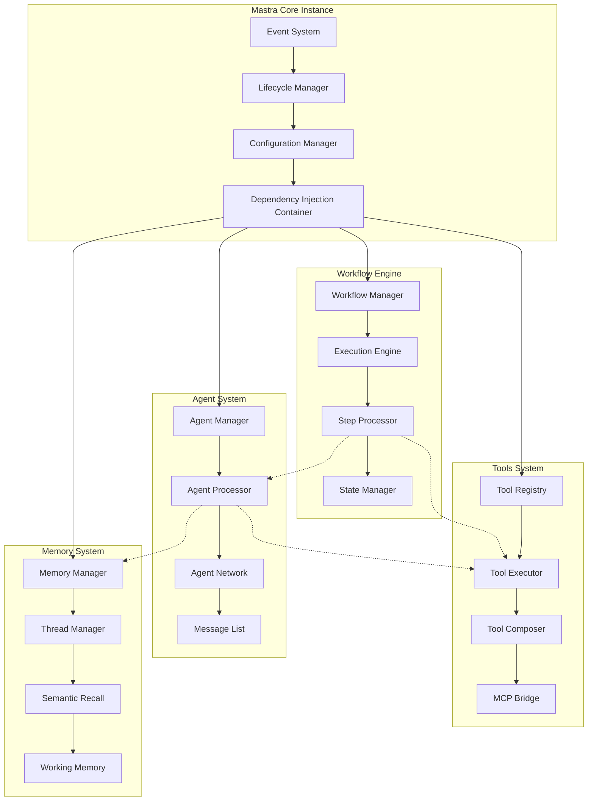
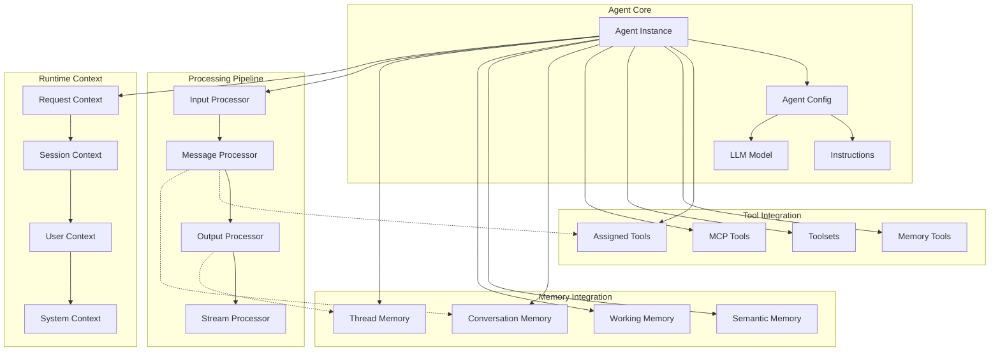
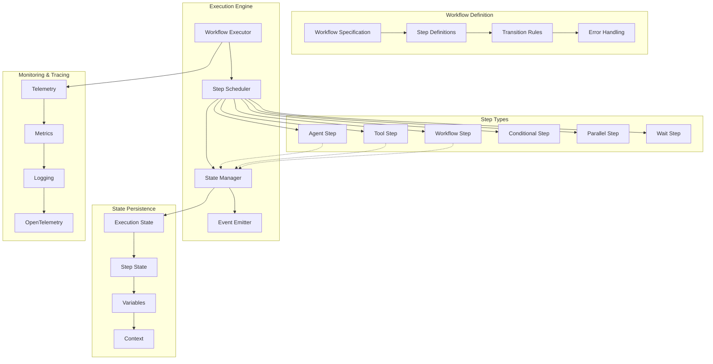
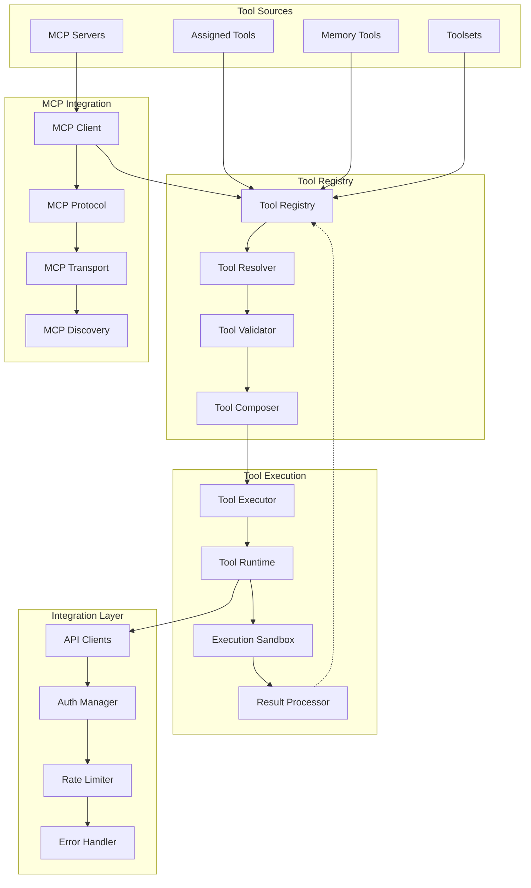
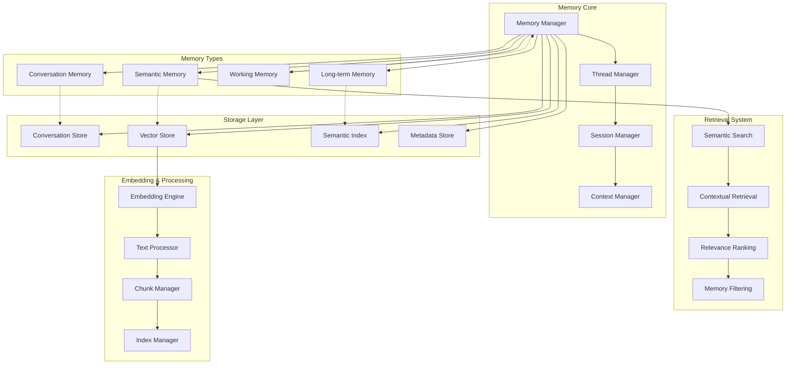

# System Architecture

This document provides a detailed view of Mastra's system architecture, breaking down the core components and their interactions.

## Core Framework Architecture

The Mastra core framework is built around a central orchestration hub with pluggable components:

## Agent System Architecture

The agent system provides the primary interface for AI interactions:

## Workflow Engine Architecture

The workflow engine manages step-based execution with suspend/resume capabilities:

## Tools & MCP System Architecture

The tools system provides dynamic tool composition from multiple sources:

## Memory System Architecture

The memory system provides thread-based conversation persistence with semantic recall:

## Storage & Infrastructure Architecture

The storage layer provides pluggable backends with standardized interfaces:

```mermaid
graph TB
    subgraph "Storage Interfaces"
        StorageInterface[Storage Interface]
        VectorInterface[Vector Interface]
        IndexInterface[Index Interface]
        CacheInterface[Cache Interface]
    end
    
    subgraph "Storage Adapters"
        PostgreSQL[PostgreSQL Store]
        Redis[Redis Store]
        FileSystem[File System Store]
        InMemory[In-Memory Store]
    end
    
    subgraph "Vector Stores"
        Chroma[Chroma DB]
        Pinecone[Pinecone]
        Weaviate[Weaviate]
        LocalVector[Local Vector]
    end
    
    subgraph "Infrastructure Services"
        AuthService[Auth Service]
        TelemetryService[Telemetry Service]
        LoggingService[Logging Service]
        MonitoringService[Monitoring Service]
    end
    
    subgraph "External Integrations"
        LLMProviders[LLM Providers]
        APIGateways[API Gateways]
        ThirdPartyAPIs[Third-party APIs]
        MCPServers[MCP Servers]
    end
    
    StorageInterface --> PostgreSQL
    StorageInterface --> Redis
    StorageInterface --> FileSystem
    StorageInterface --> InMemory
    
    VectorInterface --> Chroma
    VectorInterface --> Pinecone
    VectorInterface --> Weaviate
    VectorInterface --> LocalVector
    
    IndexInterface --> PostgreSQL
    IndexInterface --> Chroma
    
    CacheInterface --> Redis
    CacheInterface --> InMemory
    
    AuthService --> ThirdPartyAPIs
    TelemetryService --> MonitoringService
    LoggingService --> MonitoringService
    
    LLMProviders -.-> AuthService
    APIGateways -.-> AuthService
    ThirdPartyAPIs -.-> AuthService
    MCPServers -.-> AuthService
```

## Performance & Scalability Considerations

### Horizontal Scaling
- Stateless agent instances for load balancing
- Shared storage backend for state persistence
- Event-driven coordination for distributed processing

### Vertical Scaling
- Memory-efficient stream processing
- Lazy loading of tools and integrations
- Optimized vector operations for semantic search

### Caching Strategy
- Multi-level caching (memory, Redis, storage)
- Semantic cache for LLM responses
- Tool result caching with TTL

### Monitoring & Observability
- OpenTelemetry integration for distributed tracing
- Metrics collection for performance monitoring
- Structured logging for debugging and analysis

This architecture enables Mastra to scale from single-agent applications to complex multi-agent systems with enterprise-grade reliability and performance.